!SLIDE

# What did open source use to look like?

!SLIDE

# What did open source use to look like?

* Big Projects
* Sourceforge
* Mailing List
* Source code somewhere
* Trac or redmine maybe

!SLIDE

# Examples of traditional open source projects

!SLIDE
[apache](http://httpd.apache.org/)
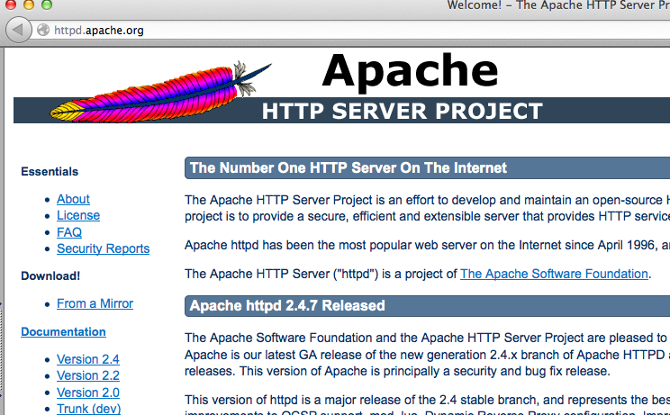

!SLIDE

!SLIDE

[debian](http://www.debian.org/)
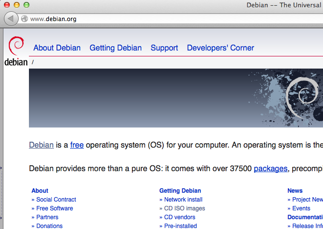

!SLIDE

[samba](http://www.samba.org/)
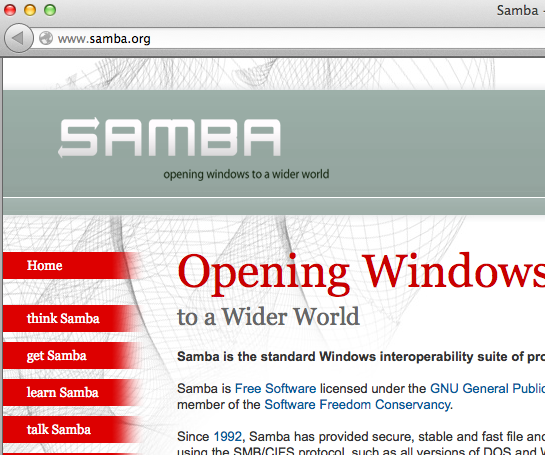

!SLIDE

[rsync](http://rsync.samba.org/)
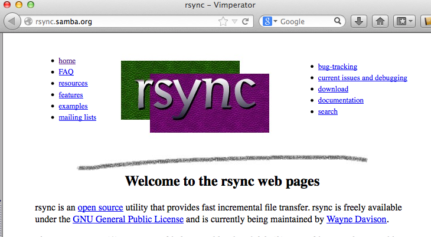

!SLIDE

[fuse](http://fuse.sourceforge.net/)
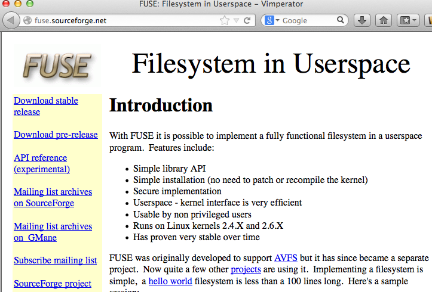

!SLIDE

[twisted](https://twistedmatrix.com/trac/)
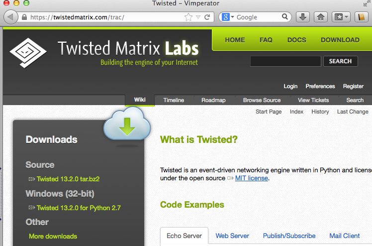

!SLIDE

[osuosl](http://osuosl.org/)
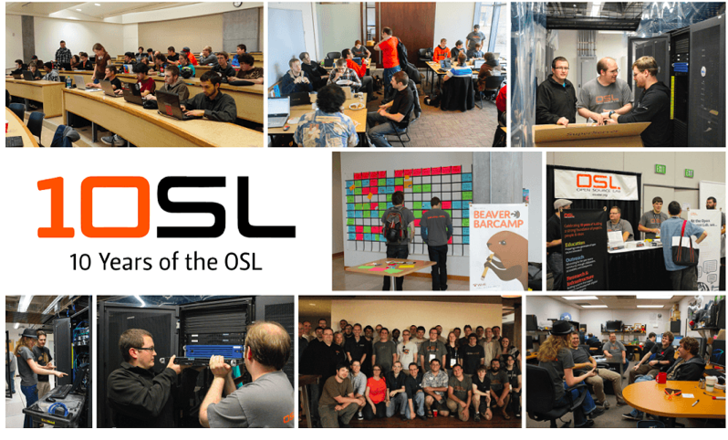

!SLIDE

If you needed any more convincing that sourceforge is dead

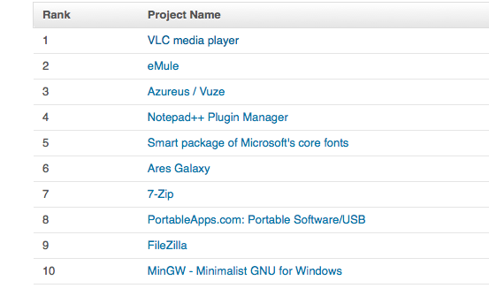

!SLIDE

# Getting (user) Support for open source projects

!SLIDE

[ldap](http://www.openldap.org/faq/data/cache/347.html)
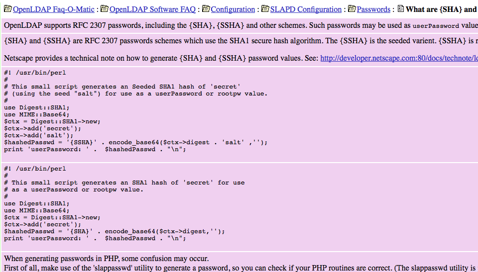

!SLIDE

[debian broo hahha](https://lists.debian.org/debian-devel/2013/10/thrd2.html#00651)
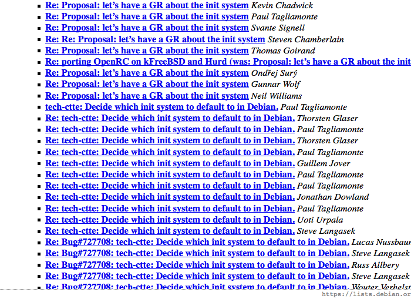

!SLIDE

[ace attorney version of debian init system debate](http://aceattorney.sparklin.org/jeu.php?id_proces=57684)

!SLIDE

# Contributing code

!SLIDE

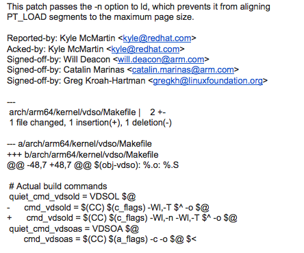

!SLIDE

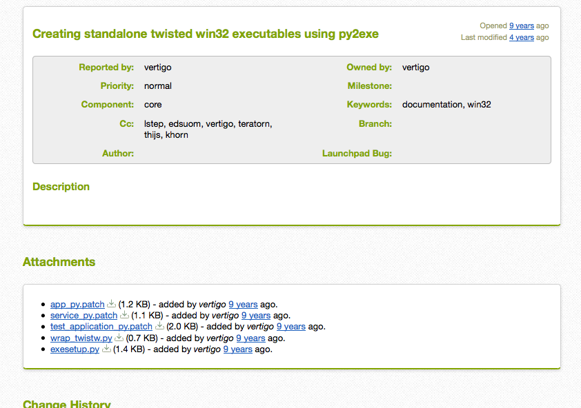

!SLIDE

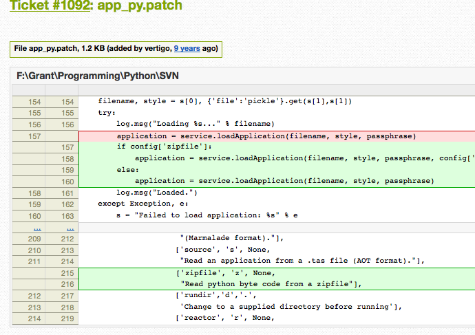
